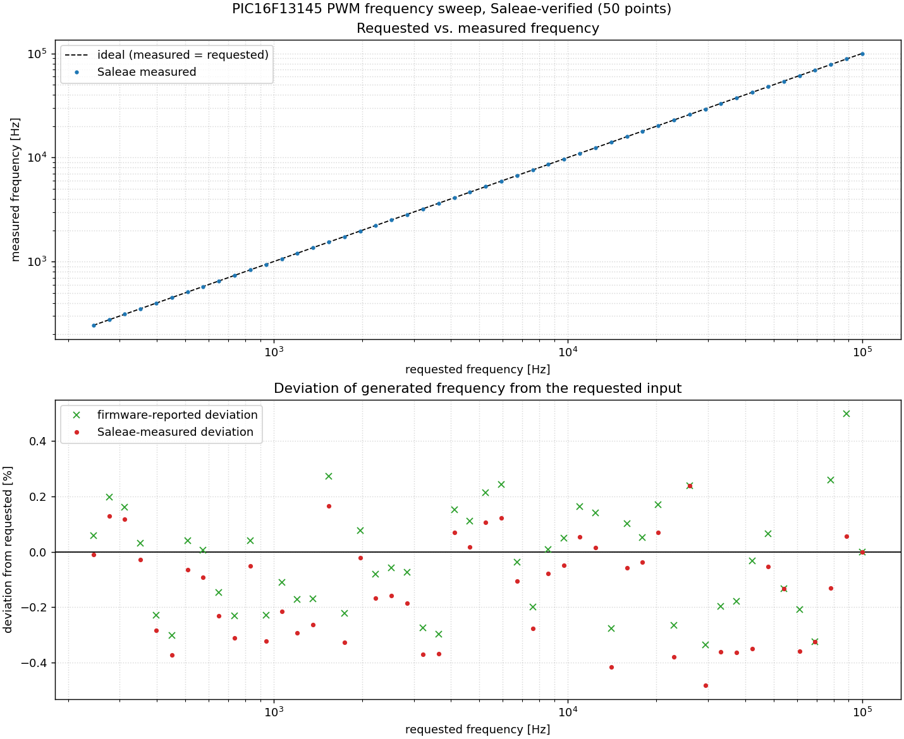
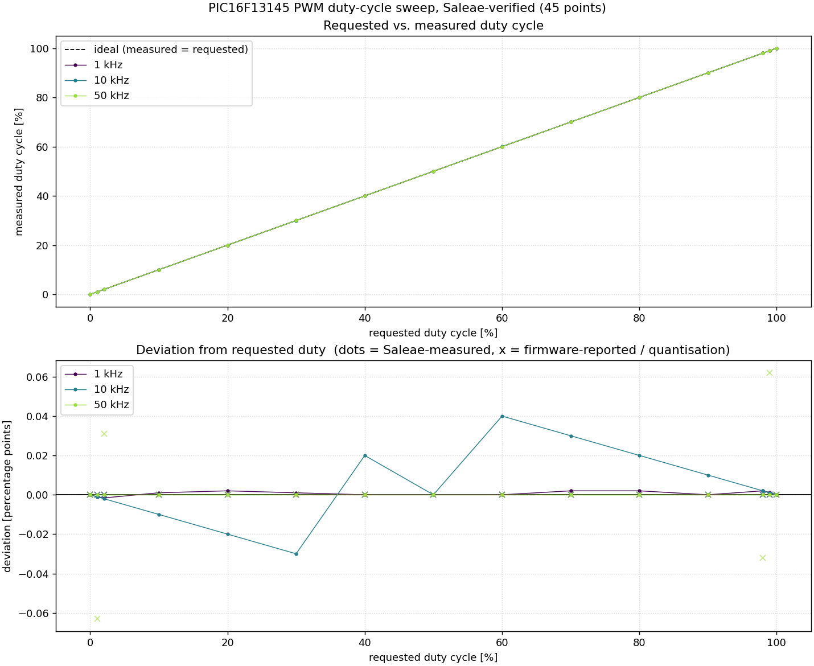

# Loop

UART command-line console with a hardware PWM generator for the
**PIC16F13145 Curiosity Nano** (EV06M52A), built with MPLAB X / XC8 (CMake project).

A serial console runs over the on-board debugger's virtual COM port (PKOB nano CDC).
Type commands to show help, query the firmware build, reset the device, or
configure and start/stop two hardware PWM channels with adjustable frequency and
duty cycle. The project can be built and flashed entirely from the command line
(`build.bat` + `flash.py`).

## Contents

- [Hardware / pin map](#hardware--pin-map)
- [Serial console commands](#serial-console-commands)
  - [How the PWM is generated](#how-the-pwm-is-generated)
  - [Achievable frequencies](#achievable-frequencies)
- [Build, flash and run](#build-flash-and-run)
  - [First-time setup (after cloning)](#first-time-setup-after-cloning)
  - [In VS Code](#in-vs-code)
  - [From the command line](#from-the-command-line)
  - [Watching the console](#watching-the-console)
- [Hardware smoke test](#hardware-smoke-test)
- [Frequency sweep](#frequency-sweep)
- [Duty-cycle sweep](#duty-cycle-sweep)
- [Serial regression tests](#serial-regression-tests)
- [Continuous integration (one command)](#continuous-integration-one-command)
- [Project structure](#project-structure)
- [Discussion of the measurement results](#discussion-of-the-measurement-results)

## Hardware / pin map

| Signal            | PIC pin | Notes                                                          |
|-------------------|---------|----------------------------------------------------------------|
| EUSART1 **TX**    | RC4     | target TX → debugger CDC RX (virtual COM port)                 |
| EUSART1 **RX**    | RC5     | debugger CDC TX → target RX                                    |
| PWM **signal A**  | RC0     | PWM1 output                                                    |
| PWM **signal B**  | RC1     | PWM2 output                                                    |

- MCU clock: HFINTOSC @ 32 MHz (`RSTOSC = HFINTOSC_32MHz`)
- Serial format: **115200 baud, 8 data bits, no parity, 1 stop bit (8N1)**
- The serial port enumerates as the *Curiosity Virtual COM Port*.

> RC4/RC5 are reserved for the UART. The PWM outputs therefore use RC0/RC1 —
> verify these pins are free on the Curiosity Nano header before wiring to them.

## Serial console commands

| Command                  | Action                                            |
|--------------------------|---------------------------------------------------|
| `help`                   | show the command list                             |
| `version`                | show the firmware build timestamp                 |
| `reset`                  | software reset (PIC16 `reset` instruction)        |
| `pulse freq <Hz>`        | set the shared PWM frequency (~244 Hz … 4 MHz)    |
| `pulse a\|b on\|off`     | enable/disable a channel output (RC0/RC1)         |
| `pulse a\|b duty <pct>`  | set a channel's duty cycle in percent             |
| `pulse status`           | show frequency, duty and on/off state of both     |

Frequency and duty accept **floating-point** values (e.g. `pulse a duty 33.3`).
Because the hardware quantises both (10-bit duty, integer Timer2 divider), the
`freq` and `duty` commands report the **actually generated** value alongside the
requested one, and `status` shows the real values — all printed as `x.xxx`:

```
> pulse freq 9600
Frequency -> 9615.384 Hz (requested 9600)
> pulse a duty 33.3
Duty A -> 33.293 % (requested 33.3)
```

The console is line-based with a `> ` prompt and a small readline-style editor:

- **← / →** move the cursor within the line.
- Typing **inserts** at the cursor; **Backspace** deletes left of it, **Del**
  deletes at it (Home/End jump to the ends).
- **↑ / ↓** recall the last **10** commands from the history.

This needs a terminal that sends ANSI arrow-key sequences (Tera Term, PuTTY,
etc.) with **DTR/RTS asserted**.

On start-up it prints a build banner so you can identify the running firmware;
the same string is available any time via `version`:

```
Loop firmware | build Jun 13 2026 23:05:18
```

The timestamp comes from the compiler's `__DATE__`/`__TIME__` macros, i.e. when
`main.c` was last compiled.

Example session:

```
pulse freq 2000
pulse a duty 25.5
pulse b duty 75
pulse a on
pulse b on
pulse status
```

→ both channels run at 2 kHz; RC0 at ~25.5 %, RC1 at 75 % duty cycle (the
console prints the exact quantised values).

### How the PWM is generated

The two dedicated PWM modules (PWM1 → RC0, PWM2 → RC1) run entirely in hardware
from a single **Timer2** time base — jitter-free and with zero CPU load (no
interrupts involved).

- `Fpwm = 8 MHz / (N × prescale)` with `N = T2PR + 1`. The firmware picks the
  smallest prescaler (1…128) that fits, maximising resolution (up to 10 bits).
- Duty cycle (10-bit): `DC = duty% × 4 × N / 100`, split across `PWMxDCH`/`PWMxDCL`.
  Duty values are automatically rescaled when the frequency changes.
- `off` clears `PWMxCON.EN`, so the module output (and the pin) goes low.

> The PIC16F13145 has only **one** PWM-capable time base (Timer2). Both channels
> therefore share a **common frequency**; only the duty cycle is independent per
> channel. Two independent frequencies would require software PWM instead.

### Achievable frequencies

With `N = T2PR+1 ∈ [2..256]` and prescaler `∈ {1, 2, 4, … 128}`:

| | Frequency | Limited by |
|---|---|---|
| **Minimum** | **≈ 244 Hz** | N = 256, prescaler = 128 (8-bit Timer2) |
| **Full 10-bit duty up to** | **31.25 kHz** | N = 256, prescaler = 1 |
| **Maximum** | **≈ 4 MHz** | N = 2, prescaler = 1 (only ~3-bit duty) |

`pulse freq` rejects anything below ~244 Hz or above ~4 MHz.

The duty resolution drops as the frequency rises (duty steps = `4 × N`,
i.e. resolution ≈ `log₂(4N)` bits):

| Frequency | Prescaler | N   | Duty steps | ~bits |
|-----------|-----------|-----|------------|-------|
| 500 Hz    | 64        | 250 | 1000       | 10    |
| 1 kHz     | 32        | 250 | 1000       | 10    |
| 2 kHz     | 16        | 250 | 1000       | 10    |
| 10 kHz    | 4         | 200 | 800        | ~9.6  |
| 31.25 kHz | 1         | 256 | 1024       | 10    |
| 100 kHz   | 1         | 80  | 320        | ~8.3  |
| 500 kHz   | 1         | 16  | 64         | 6     |
| 1 MHz     | 1         | 8   | 32         | 5     |
| 4 MHz     | 1         | 2   | 8          | 3     |

Notes:

- "Round" frequencies (500 Hz, 1/2/10 kHz, …) come out exact. Other values are
  rounded because `N` is an integer; the error grows toward high frequencies
  (near 100 kHz, `N±1` already shifts the frequency by ~1 kHz).
- For clean PWM with ≥ 8-bit duty, the practical range is **~244 Hz … ~120 kHz**.
  Higher still works, but the duty resolution becomes coarse.

## Build, flash and run

Connect the Curiosity Nano via USB first (the on-board PKOB nano debugger is
detected automatically).

### First-time setup (after cloning)

Two Python helpers adapt a fresh clone to your machine (both support `--auto` to
run unattended):

```
python setup_compiler.py    :: choose the installed XC8 version, patch toolchain.cmake
python setup_flasher.py     :: detect the Curiosity Nano, store its COM port
```

- `setup_compiler.py` scans `C:\Program Files\Microchip\xc8\`, lets you pick a
  version and patches `cmake/Loop/default/.generated/toolchain.cmake` so
  `build.bat` uses it — run it if your XC8 version/location differs from the one
  baked into the committed `toolchain.cmake`. Saves `setup_compiler.config`.
- `setup_flasher.py` finds the board's *Curiosity Virtual COM Port* and writes
  `setup_flasher.config`; the Python tools (`smoketest.py`, `regression.py`,
  `run_ci.py`, …) then default their `--port` to it (fallback `COM12`). Flashing
  itself auto-detects the on-board `pkobnano` debugger.

After that, `build.bat` / `flash.py` / `run_ci.py` work with no extra arguments.

### In VS Code

1. Build: **Ctrl + Shift + B** (CMake + XC8 toolchain).
2. Flash with the MPLAB extension, or use `flash.py` (below).

### From the command line

```
build.bat              :: configure (if needed) and build  -> out\Loop\default.elf/.hex
build.bat rebuild      :: clean, then build
build.bat clean        :: remove the build tree and output

python flash.py        :: program out\Loop\default.hex via MPLAB MDB, then run
python flash.py --list :: list detected debuggers (no programming)
```

- `build.bat` drives the CMake preset and Ninja. It needs CMake and Ninja on
  PATH; XC8 is referenced with an absolute path by the generated toolchain file.
- `flash.py` drives `mdb.bat` (MPLAB Debugger Backend): it selects the on-board
  `pkobnano` debugger, programs the HEX over ICSP and releases the target so it
  starts running. Use `--serial <SN>` to pick a specific board, `--hex <path>`
  for a different image. Requires MPLAB X installed (auto-detects the newest
  `mdb.bat`).

### Watching the console

Open the *Curiosity Virtual COM Port* in a terminal (MPLAB Data Visualizer,
PuTTY, Tera Term) at **115200 8N1** with **DTR/RTS asserted** (most terminals do
this by default). You should see the build banner and `> ` prompt — then e.g.
`pulse a duty 50`, `pulse a on`, and probe RC0 with a scope or logic analyzer.

All registers, bits and configuration tokens are taken from the PIC16F13145 data
sheet and the installed device family pack (DFP `PIC16F1xxxx_DFP`).

## Hardware smoke test

`smoketest.py` verifies the PWM output in hardware with a Saleae logic analyzer:
it drives the console over the serial port, records RC0/RC1, exports the raw data
to CSV and checks the measured frequency and duty cycle against what the firmware
reports it generated.

Setup:

- Saleae **channel 0 → RC0**, **channel 1 → RC1**, common ground.
- Logic 2 running with the **automation server enabled**
  (Preferences → Automation, default port 10430).
- `pip install logic2-automation pyserial`

```
python smoketest.py                       :: full HW test on COM12
python smoketest.py --sample-rate 25000000:: use a different sample rate
python smoketest.py --analyze smoketest_csv\test3 :: re-analyse an existing CSV
python smoketest.py --selftest            :: validate the analyser (no hardware)
```

For each case it sends `pulse freq/duty/on/off`, captures both channels, and
measures frequency (median of rising-edge intervals) and duty (high-time /
period). Pass criteria: frequency within **3 %** (covers the HFINTOSC ±2 %
tolerance), duty within **2 percentage points**; a disabled channel must read
low. The captured raw data is written to `smoketest_csv\test<N>\digital.csv`, so
`--analyze` can re-evaluate it offline at any time.

Example result (all four cases passing): 1 kHz @ 25 %/75 %, 5 kHz @ 10 %/50 %,
20 kHz @ 33.3 %/66.7 %, and one channel disabled — measured duty matched the
firmware's quantised values exactly, frequency to within the oscillator tolerance.

## Frequency sweep

`freq_sweep.py` sweeps the whole achievable frequency range and verifies **each
point with the Saleae**, then plots how far the generated frequency deviates from
the requested input (the deviation is the quantisation of the integer Timer2
divider). For every log-spaced requested frequency it sets `pulse freq`, records
RC0, measures the real frequency from the capture and records it.

```
python freq_sweep.py                       :: sweep on COM12, show the plot
python freq_sweep.py --points 80 --fmax 100000
python freq_sweep.py --sample-rate 25000000 --fmax 250000
python freq_sweep.py --no-show             :: save PNG/CSV only
```

It writes `freq_sweep.csv` (requested / firmware-reported / measured / deviation /
samples-per-period) and `freq_sweep.png` (requested-vs-measured plus the deviation
in %, both Saleae-measured and firmware-reported). The usable top frequency is
bounded by the sample rate (10 MS/s → ~100 kHz with good resolution; the tool
warns below 50 samples per period). A typical run stays within ±0.5 % deviation,
with exactly-achievable frequencies (e.g. 50 kHz) landing at 0 %.



## Duty-cycle sweep

`duty_sweep.py` is the duty counterpart: it sweeps the duty cycle 0…100 % **at
several frequencies** and verifies each point with the Saleae. Because the duty
is quantised to `DC = duty% * 4 * N / 100` and `N` shrinks with frequency, the
achievable resolution gets coarser as the frequency rises — the plot overlays the
curves per frequency to show this.

```
python duty_sweep.py                          :: default 1/10/50 kHz, show plot
python duty_sweep.py --freqs 1000,20000,100000
python duty_sweep.py --duty-step 2            :: finer duty sweep
python duty_sweep.py --sample-rate 25000000   :: resolve finer steps at high f
```

It writes `duty_sweep.csv` and `duty_sweep.png` (requested-vs-measured and the
deviation in percentage points, with Saleae-measured dots and the firmware's
quantisation as `x`). Note: at 10 MS/s the Saleae resolves ~0.5 pp at 50 kHz, so
the firmware's sub-step quantisation there is only visible at a higher sample rate.



## Serial regression tests

`regression.py` checks the console behaviour **over the serial port only** (no
logic analyzer needed), so it runs fast and catches firmware bugs early:

- **Input validation & boundaries** — out-of-range frequency rejected, duty
  clamped at 100 %, invalid/negative input and unknown commands reported.
- **Line editor & history** — mid-line insert, Backspace and Up/Down recall.
- **RX stress** — 30 commands streamed at full rate; every one must be parsed
  (guards the redraw/RX-overrun regression that was found and fixed).
- **Reset** — `reset` reboots the device and restores power-on defaults.

```
python regression.py            :: run on COM12, write regression_report.html
```

It writes its own `regression_report.html`. (These tests once caught a real
bug — `pulse freq 9000000` was silently accepted because the millivalue parser
overflowed; the frequency path now parses integer Hz directly.)

## Continuous integration (one command)

`run_ci.py` ties the whole pipeline together and produces a single HTML protocol:

```
python run_ci.py                 :: build -> flash -> regression + smoke -> report.html
python run_ci.py --skip-build    :: use the existing binary
python run_ci.py --skip-flash    :: test the firmware already on the target
```

It runs, in order: **build** (`build.bat`), **flash** (`flash.py`/MDB),
**serial regression** and the **Saleae smoke test** (including the duty-held-
across-frequency check), then writes **`report.html`** — a self-contained
protocol with an overall PASS/FAIL banner, a summary table, every individual
check, the build's memory usage, and the firmware build stamp / analyzer model
in the header. The process exit code is 0 only if everything passed, so it drops
straight into a CI job. The frequency- and duty-sweep plots are embedded if they
are present in the folder.

## Project structure

| Path                    | Purpose                                                                                                                             |
|-------------------------|-------------------------------------------------------------------------------------------------------------------------------------|
| main.c                  | Application: UART console, command parser and hardware PWM control                                                                  |
| setup_compiler.py       | Pick the XC8 version and patch `toolchain.cmake` (writes `setup_compiler.config`)                                                   |
| setup_flasher.py        | Detect the Curiosity Nano COM port (writes `setup_flasher.config`)                                                                  |
| project_config.py       | Reads `setup_flasher.config` for the tools' default `--port`                                                                        |
| build.bat               | Command-line build wrapper (CMake preset + Ninja)                                                                                   |
| flash.py                | Command-line flash tool driving the MPLAB MDB (programs over ICSP)                                                                  |
| smoketest.py            | Hardware smoke test: drives the console + Saleae, exports CSV and checks freq/duty                                                  |
| freq_sweep.py           | Saleae-verified frequency sweep; plots deviation vs. requested (matplotlib)                                                         |
| duty_sweep.py           | Saleae-verified duty-cycle sweep at several frequencies; plots deviation (matplotlib)                                               |
| regression.py           | Serial-only regression suite (validation, line editor, RX stress, reset)                                                            |
| run_ci.py               | One-command CI: build → flash → regression + smoke → `report.html`                                                                  |
| testreport.py           | Shared result model + self-contained HTML report writer                                                                            |
| report.html             | Generated CI protocol (overall verdict + every check); `regression_report.html` likewise                                           |
| smoketest_csv           | Raw `digital.csv` captures from the last smoke-test run (re-analysable)                                                             |
| _build                  | The [CMake build tree](https://cmake.org/cmake/help/latest/manual/cmake.1.html#introduction-to-cmake-buildsystems), can be deleted. |
| cmake                   | Generated [CMake](https://cmake.org/) files. May be deleted if user.cmake has not been added                                        |
| .vscode                 | See [VSCode](https://code.visualstudio.com/docs/getstarted/settings)                                                                |
| .vscode\settings.json   | Workspace specific settings                                                                                                         |
| .vscode\Loop.mplab.json | The MPLAB project file, should not be deleted                                                                                       |
| out                     | Final build artifacts                                                                                                               |

## Discussion of the measurement results

Each sweep produces **two** numbers per point that must not be confused:

- **firmware-reported value** — what the device *intends* to generate, computed
  from the integer divider `N` / prescaler (frequency) or the 10-bit `DC` (duty).
  Its difference from the *requested* input is pure **quantisation**.
- **Saleae-measured value** — what the analyzer actually *sees* on the pin. Its
  difference from the *firmware-reported* value is **oscillator tolerance plus
  measurement error**.

Keeping the two apart is what makes the tests meaningful: quantisation is a known,
exactly predictable property of the firmware, while everything else is the real
analogue world.

### Frequency

A representative run (244 Hz … 50 kHz, 10 MS/s):

| requested | firmware | measured | meas − firmware |
|----------:|---------:|---------:|----------------:|
| 1 439 Hz  | 1 436.78 | 1 435.75 | −0.072 % |
| 8 481 Hz  | 8 474.58 | 8 467.40 | −0.085 % |
| 15 321 Hz | 15 267.17| 15 243.90| −0.152 % |
| 27 678 Hz | 27 586.21| 27 548.21| −0.138 % |
| 50 000 Hz | 50 000.00| 50 000.00|  0.000 % |

- **firmware vs requested** is the staircase quantisation — e.g. 15 321 Hz is not
  achievable, the nearest divider gives 15 267 Hz (−0.35 %). Exactly-achievable
  frequencies such as 50 kHz (N = 160, prescale 1) show 0 %.
- **measured vs firmware** is a small, *consistent* negative offset of roughly
  **−0.1 … −0.15 %**. It is systematic (a near-constant ratio, not random scatter),
  so it is not measurement noise — it is the **HFINTOSC running slightly slow**.
  The internal oscillator is specified to ±2 % at calibration; the observed
  −0.1 % is comfortably inside that and is the dominant real-world error.
- **Is the Saleae too imprecise here? No** — in the tested range it is not the
  limiting factor. It timestamps edges on a 100 ns grid (10 MS/s), but the period
  is the *median of hundreds of rising-edge intervals*, so the per-edge ±100 ns
  averages out. 50 kHz lands on exactly 200 samples/period and measures to the
  last digit. The Saleae only becomes the bottleneck as **samples-per-period
  drops toward the sample rate** — above ~100–200 kHz at 10 MS/s; the tool warns
  below 50 samples/period.

### Duty cycle

A representative run at two frequencies (10 MS/s):

| requested | 1 kHz fw / meas | 50 kHz fw / meas |
|----------:|-----------------|------------------|
| 1 %  | 1.00 / 1.00 | **0.94 / 1.00** |
| 2 %  | 2.00 / 2.00 | **2.03 / 2.00** |
| 50 % | 50.00 / 50.00 | 50.00 / 50.00 |
| 99 % | 99.00 / 99.00 | **99.06 / 99.00** |

- At **1 kHz** the firmware hits the request exactly (N = 250 → 1000 duty steps,
  0.1 pp each) and the Saleae confirms it exactly. No error anywhere.
- At **50 kHz** the firmware *quantises*: N = 160 → only `4N = 640` steps =
  **0.156 pp** per step, so 1 % becomes 0.94 %, 99 % becomes 99.06 %. This is
  correct, expected hardware behaviour.
- **This is where the Saleae is too imprecise.** Its duty resolution is one
  sample per period, i.e. `frequency / sample_rate`. At 50 kHz / 10 MS/s that is
  `1/200 = 0.5 pp` — *coarser* than the firmware's 0.156 pp step. So the analyzer
  rounds 0.94 % back to 1.00 %: the `measured ≠ firmware` discrepancy at the duty
  extremes is a **measurement limitation, not a hardware fault**. (The median
  edge-count snaps to the integer sample grid, which also prevents sub-sample
  averaging from recovering it.)

The effect is purely a function of samples-per-period:

| frequency @ 10 MS/s | samples/period | duty resolution |
|--------------------:|---------------:|----------------:|
| 1 kHz   | 10 000 | 0.01 pp |
| 10 kHz  | 1 000  | 0.10 pp |
| 50 kHz  | 200    | 0.50 pp |
| 100 kHz | 100    | 1.00 pp |

### Conclusion

- The firmware behaves exactly as modelled: frequency and duty deviations from the
  request are the predicted integer quantisation, and the Saleae confirms them
  wherever it has the resolution to do so.
- The only genuine analogue error is the **HFINTOSC frequency offset (~−0.1 %)**,
  well within its ±2 % spec.
- **The Saleae is the limiting instrument only for duty at high frequency** (few
  samples per period) and, secondarily, for frequency as the signal approaches the
  sample rate. To resolve the firmware's fine duty steps at ≥ 50 kHz, raise the
  sample rate (`--sample-rate 25000000` or `50000000`) so there are ≥ 1000
  samples/period again.
