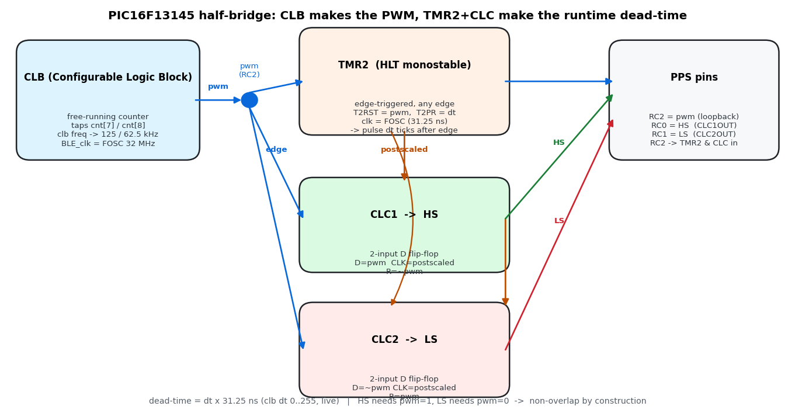
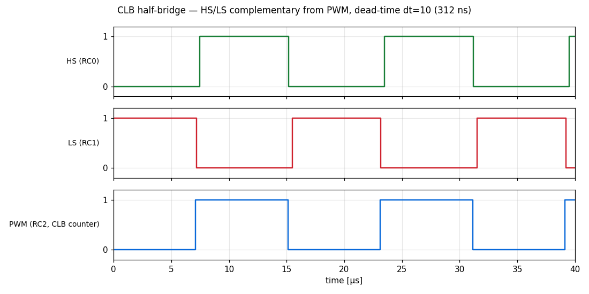
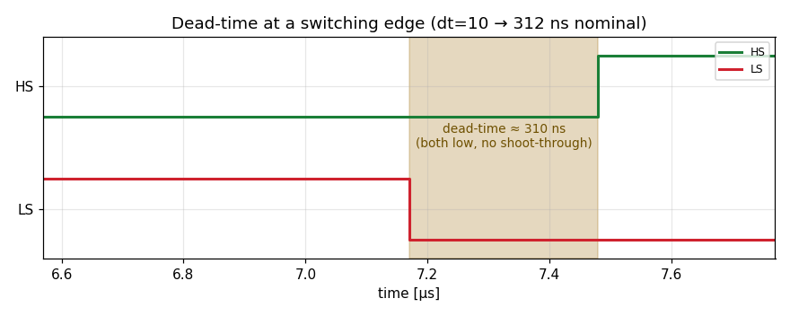

# CLB Half-Bridge with Runtime-Adjustable Dead-Time — Hardware-in-the-Loop

A complementary **half-bridge** on RC0 (high-side) / RC1 (low-side) of the
PIC16F13145, driven from one PWM, with a **dead-time that is adjustable at run
time over the serial console** (`clb dt <0-255>`). The PIC16F13145 has no CWG, so
the logic is built from the on-chip programmable fabric — but **not** the way you
might first expect (see *Why this architecture* below).

> **Status: ✅ working and hardware-verified.** Dead-time = `dt × 31.25 ns`,
> measured to match across `dt = 2/5/10/20` (60/160/310/620 ns), with **guaranteed
> non-overlap** (no shoot-through) at every setting. `clb_hil_report.html` / the
> Saleae test pass 5/5.
>
> **Audience:** a future Claude Code session or engineer continuing this work.
> Read this file first.

---

## 0. The CLB peripheral — architecture primer

Before the half-bridge specifics: what the **CLB (Configurable Logic Block)** on
the PIC16F13145 actually *is*, and why it is used the way it is here.

### What it is
Unlike CLC, CWG or NCO — fixed-function blocks you configure with a handful of
registers — the CLB is a small, **FPGA-like programmable logic fabric**. You
describe logic in **Verilog**, a synthesizer turns it into a **bitstream**, and
that bitstream is loaded into the fabric. It replaces external glue logic; in this
project it stands in for the **CWG the PIC16F13145 doesn't have** (half-bridge).

### Internal structure
```
   muxed pin/peripheral inputs ┐
   (IN0..INn)                  │
   software inputs             ├──▶ ┌──────────────────────────────┐ ──▶ PPS outputs
   (CLBSWIN0..n)               │    │  BLE fabric                   │     (CLBPPSOUT0..7) ─▶ RCx
   BLE_clk (global) ───────────┘    │  LUTs + flip-flops            │ ──▶ interrupts
                                     │  + routing matrix             │     (CLB_IRQ0/1)
                                     │  + counter primitives         │
                                     └──────────────────────────────┘
```

- **BLEs (Basic Logic Elements)** — the core: each is a **LUT + flip-flop**, exactly
  like an FPGA cell. The synthesizer builds combinational logic from the LUTs and
  sequential logic from the FFs (our tiny counter design mapped to ~9 LUTs + several
  DFFs).
- **Inputs**, three sources:
  - **Muxed inputs `IN0..INn`** — a mux selects a pin (via PPS) *or* an internal
    peripheral signal (DS Table 29-1, e.g. `PWM1_OUT=0b10000`, `CLC1-4_OUT`,
    `TMR2_postscaled`). Set in Verilog via `(* pincfg.IN0.mux = 7'd<code> *)`.
  - **Software inputs `CLBSWIN0..n`** — bits the CPU writes straight into the fabric
    (runtime parameters).
  - **`BLE_clk`** — the global fabric clock (below).
- **Outputs:** `CLBPPSOUT0..7` (PPS codes `0x24..0x2B`) → any RCx pin via PPS; plus
  two interrupt sources `CLB_IRQ0/1` to the CPU.
- **Clock `BLE_clk`** — a *global* clock, **not** routed through the normal inputs.
  Source via `CLBCLK` (here `0x05` = FOSC = measured **32.000 MHz**), with a
  clock divider (`syscfg.CLKDIV`) to run the fabric slower. Do **not** map the clock
  to an `IN` pin in the XDC, or P&R fails with "clock could not be routed".

### How it is configured / loaded
The CLB is **not register-programmed** — it is **bitstream-loaded**:
1. Verilog ([clb/clb_halfbridge.v](clb/clb_halfbridge.v)) + constraints
   ([clb/clb_halfbridge.xdc](clb/clb_halfbridge.xdc)) →
2. synthesizer (Yosys + VPR, headless via `pyclbsynthesizer`) → a bitstream of **N
   14-bit program words** (here **102 words**, in [clbBitstream.S](clbBitstream.S),
   PSECT `clb_config`) →
3. loaded at runtime by the **NVM scanner together with the CRC engine** (not plain
   register writes). Order is critical: `CRCCON0.EN/GO=1` **first**, *then*
   `SCANCON0.SGO`, in **burst mode** (`SCANCON0.MD=0b01`) — otherwise the scan
   aborts (`DABORT`) and every CLB output sits static.

Which scan-chain bit maps to which LUT/FF/route is **undocumented** — that is why the
bitstream can't be hand-written and the synthesizer is mandatory.

### The key constraint that shapes this whole project
> **The PIC16F13145 CLB synthesizer reliably maps only ONE construct type per design.**
> A free-running counter *alone* works; combinational logic + an input *alone* works;
> a counter **combined** with an input and gating in one design does **not** (the
> counter goes dead on silicon though the netlist looks correct — see §6, matches Jira
> LOGIC-2847 / LOGIC-2274).

So here the CLB does **only the free-running counter** (the one shape it maps
perfectly), and all stateful/gating logic lives in the reliable, register-configured
**TMR2-HLT** and **CLC** blocks — the architecture detailed in §1 below. Practical
fabric limits found: P&R is bit-sensitive (`cnt[8]` routes, `cnt[9]` doesn't; 2 taps
route, 3 don't), a lone clocked output won't route (needs a 2nd output), and synthesis
is deterministic (same `.v` → byte-identical bitstream).

---

## 1. Block diagram of the implemented logic



The dead-time generation is split across three reliable, register-configured
blocks; the CLB does **only** the part it maps reliably (a free-running counter):

| Block | Job |
|-------|-----|
| **CLB** | free-running counter → two taps `cnt[7]`/`cnt[8]` (~125/62.5 kHz) on CLBPPSOUT0/1; firmware routes the one selected by `clb freq` → **RC2**. |
| **TMR2** (HLT) | edge-triggered **monostable**, retriggered by every `pwm` edge; counts `T2PR = dt` FOSC ticks (31.25 ns) then emits `TMR2_postscaled`. |
| **CLC1 / CLC2** | two D-flip-flops that turn `pwm` + `postscaled` into the complementary, dead-timed **HS / LS**. |

```
 CLB counter ─pwm─▶ RC2 ─┬─▶ TMR2 (monostable, T2PR=dt) ─postscaled─┐
                         │                                          ▼
                         ├─▶ CLC1 D-FF: D=pwm , CLK=postscaled, R=~pwm ─▶ HS ─▶ RC0
                         └─▶ CLC2 D-FF: D=~pwm, CLK=postscaled, R=pwm  ─▶ LS ─▶ RC1
```
`HS` can be high only while `pwm = 1`, `LS` only while `pwm = 0` → **non-overlap is
guaranteed by construction**, not by timing margins. After each `pwm` edge the
output stays low until `postscaled` fires `dt` ticks later (the dead-time), then
the D-FF samples the new level.

---

## 2. Measured signals

Complementary HS/LS generated from the CLB PWM (dt = 10 → 312 ns nominal):



Zoom on one switching edge — the shaded window is the measured dead-time where
**both** sides are low:



**Dead-time sweep (Saleae, 100 MS/s, ~62.5 kHz):**

| `clb dt` | nominal (dt × 31.25 ns) | measured | overlap |
|---------:|------------------------:|---------:|:-------:|
| 2  | 62 ns  | **60 ns**  | 0.000 % |
| 5  | 156 ns | **160 ns** | 0.000 % |
| 10 | 312 ns | **310 ns** | 0.000 % |
| 20 | 625 ns | **620 ns** | 0.000 % |

Linear, monotonic, and shoot-through-free at every step.

---

## 3. Bench setup

| Item | Detail |
|------|--------|
| Board | PIC16F13145 Curiosity Nano (EV06M52A), USB |
| Logic analyzer | Saleae Logic 8, Logic 2 automation server on port 10430 |
| **Wiring** | **RC0→ch0 (HS), RC1→ch1 (LS), RC2→ch2 (PWM), RC3→ch3**, common ground |
| Synthesis | `pyclbsynthesizer` → `dev.logic.microchip.com/continuous` (or local Docker) |
| Python | `pip install pyserial logic2-automation matplotlib` + `pyclbsynthesizer` |

RC2 carries the CLB-generated PWM (it loops back into TMR2's reset and the CLCs).

---

## 4. The toolchain (run order)

| File | Role |
|------|------|
| `clb/clb_halfbridge.v` | CLB design — **just the free-running PWM counter**. |
| `clb/synth.py` | headless Verilog → `clbBitstream.S` + `clb1_defs.h` (`pyclbsynthesizer`). |
| `main.c` → `CLB_SetEnabled()` | loads the CLB, configures **TMR2 monostable + the 2 CLC D-FFs + PPS**. |
| `clb_halfbridge_test.py` | Saleae test: per-`dt` non-overlap, switching, dead-time = dt×31.25 ns. |
| `clb_hil.py` | orchestrator → `clb_hil_report.html` (live log `clb_hil.log`). |
| `clb_debug.py` | manual CLI + N-channel capture (per-channel freq/duty/level). |
| `clb/plot_signals.py` | capture HS/LS/PWM and render the matplotlib figures above. |
| `clb/blockdiagram.py` | render the block diagram above. |
| `clb/sim_halfbridge.py` | cycle-accurate Python model (used while debugging the RTL). |
| `clb_analyze.py` + `clb/catalog/` | **CLB capability suite** — runs ~15 micro-designs through synth + silicon, → `clb_capability_report.html` (see §6b). |
| `clb_hb_report.py` | **Comprehensive half-bridge test** — sweeps freq × dead-time on the Saleae, → self-contained `clb_hb_report.html` (design + CLI guide + plots + accuracy verdicts). Dead-time tracks `dt × 31.25 ns` to within ~10 ns (1 sample), 0 ns shoot-through at all settings. |

```cmd
:: build the CLB bitstream (one-time per design change)
python clb\synth.py

:: build + flash the firmware
build.bat  &  python flash.py

:: hardware test + reports
python clb_halfbridge_test.py --csv-dir C:\work\Loop\clb_hb_csv   :: -> clb_halfbridge_report.html
python clb_hil.py --skip-build                                    :: -> clb_hil_report.html
python clb\plot_signals.py --dt 10                                :: -> clb/clb_signals.png, clb/clb_deadtime_zoom.png
python clb\blockdiagram.py                                        :: -> clb/clb_blockdiagram.png

:: manual probing (Saleae channels 0..3 = RC0..RC3)
python clb_debug.py --cmds "clb dt 10;clb on" --channels 0,1,2 --sample-rate 100000000
```

### Console commands
```
clb on              enable the half-bridge (RC0=HS, RC1=LS, RC2=PWM)
clb off             disable -> RC0/RC1 back to the plain PWM modules
clb dt <0-255>      dead-time in 31.25 ns ticks, written live to T2PR
clb freq <0-1>      PWM frequency: 0 = ~125 kHz, 1 = ~62.5 kHz (live)
clb status          show on/off + dead-time + PWM frequency
pinid               GPIO-toggle RC0..RC3 1x/2x/3x/4x -> verify Saleae probe wiring
```

### Frequency selection
The PWM frequency is **switchable at run time** between **~125 kHz** and **~62.5 kHz**
(`clb freq 0|1`). The CLB counter exposes two octave-spaced taps (`cnt[7]`, `cnt[8]`) on
CLBPPSOUT0/1; `clb freq` just re-points `RC2PPS` at the chosen tap — no re-synthesis. The
dead-time is generated by TMR2 off FOSC, so it stays `dt × 31.25 ns` **independently** of
the PWM frequency (verified: dt=10 → ~310 ns at both 125 kHz and 62.5 kHz, non-overlap at
both). Only **two** taps are offered because the CLB place-and-route will not route three or
more high-bit counter outputs (the same fabric limit documented below); a continuously
variable frequency would need a programmable divider (a counter+comparator) which the CLB
synthesizer cannot map, or an external/timer PWM source (which conflicts with TMR2 being the
dead-time monostable).

---

## 5. Key register configuration (in `CLB_SetEnabled`, `main.c`)

- **PMD** (Peripheral Module Disable — bare-metal must clear these, MCC does it for you):
  `PMD0.NVMMD/CRCMD/SCANMD = 0`, `PMD4.CLBMD = 0`, `PMD2.CLC1MD/CLC2MD = 0`, `PMD1.TMR2MD = 0`.
- **CLB load:** NVM scanner with the CRC engine on first (`CRCCON0.EN/GO = 1` *before*
  `SCANCON0.SGO`, else `DABORT` aborts), **burst mode** (`SCANCON0.MD = 0b01`),
  `CLBCLK = 0x05` (FOSC → BLE_clk 32 MHz). `CLBPPSCONn = 0`.
- **TMR2:** `T2INPPS = 0x12` (RC2), `T2CLKCON = 0x02` (FOSC), `T2RST = 0x00` (pin),
  `T2HLT = 0x13` (MODE 10011 = edge monostable, any edge), `T2PR = dt`, `T2CON.ON = 1`.
- **CLCs** (this family uses the **CLCSELECT** indirection — write `CLCSELECT`, then the
  shared `CLCnCON/CLCnSEL/CLCnGLS/CLCnPOL`): data `d1=pwm` (`CLCnSEL0=0`, `CLCIN0PPS=RC2`),
  `d2=TMR2_postscaled` (`CLCnSEL1=16`); gates **g1=CLK, g2=D, g3=R**; `CLCnCON=0x85`
  (EN, MODE 101 = 2-input D-FF with Reset).
  - CLC1 (HS): `GLS0=0x08` (CLK←postscaled), `GLS1=0x02` (D←pwm), `GLS2=0x01` (R←~pwm).
  - CLC2 (LS): `GLS0=0x08`, `GLS1=0x01` (D←~pwm), `GLS2=0x02` (R←pwm).
- **Pins:** `RC2PPS=0x24` (CLBPPSOUT0=pwm), `RC0PPS=0x01` (CLC1OUT=HS), `RC1PPS=0x02` (CLC2OUT=LS).

Useful data-sheet codes (PIC16F13145): CLB inputs (Table 29-1) PWM1_OUT=`0b10000`,
CLC1-4_OUT=`0b10011..10110`, TMR2_postscaled=`0b01101`, CLBIN0PPS=0. PPS outputs (Table 18-2)
CLBPPSOUT0-7 = `0x24..0x2B`, CLC1-4OUT = `0x01..0x04`. CLC inputs (Table 28-2)
TMR2_Postscaled = [16]. BLE_clk measured = **32.000 MHz** (`measure_ble.py`).

---

## 6. Why this architecture — what didn't work, and the lesson

The obvious approach (do the whole half-bridge in the CLB from one Verilog design)
was pursued first and **failed repeatedly**. The hard-won finding:

> **The PIC16F13145 CLB synthesizer reliably maps only ONE construct type at a time.**
> A free-running counter *alone* works; combinational logic + an input *alone* works;
> but a counter **combined** with an input and gating in one design does not (the
> counter goes dead on silicon, though the netlist looks correct). Matches Jira
> LOGIC-2847 / LOGIC-2274 (CLB synthesizer inconsistency).

Evidence gathered (all on real hardware, cross-checked against a cycle-accurate
Python model that proved each RTL *correct*):

| Attempt (all-in-CLB) | Result on silicon |
|----------------------|-------------------|
| edge-reset counter (`if(edge) cnt<=0; cnt==dt`) | counter never resets → no dead-time |
| shift-register delay line (`pwm_del = hist[dt]`) | non-overlap OK, but the delay never forms |
| counter + input + gating (one design) | counter dead (static), even though netlist is correct |
| free-running counter **alone** (clk-probe) | **works** (measured BLE_clk = 32 MHz) |
| combinational + input **alone** (async passthrough) | **works** |

Other gotchas found along the way (also true for the working design):
- The CLB **NVM-scanner load** needs the CRC engine enabled+started first, in
  **burst** mode, or the bitstream never loads (every CLBPPSOUT reads static high).
- `CLBCLK = HFINTOSC (0x06)` left BLE_clk **not running** for clocked designs; `FOSC
  (0x05)` clocks them.
- PnR is **bit-sensitive**: `cnt[9]` failed "clock not routed", `cnt[8]` routes; a lone
  clocked output won't route (needs a 2nd output).
- The XDC must have **no `#` comment lines**; the synthesizer is **deterministic**
  (same `.v` → identical bitstream — the earlier "non-determinism" was edits between runs).

**The fix** was to stop fighting the CLB: give it only the counter (which it maps
perfectly) and move all the stateful/gating logic into the **CLC** peripherals and
**TMR2-HLT**, which are plain register-configured hardware and completely reliable.

---

## 7a. Alternative variant: frequency-priority (`clbf`) — measured, then removed

> **Note:** the `clbf` mode below was implemented and **hardware-verified**, then
> **removed from the firmware** to reclaim program memory (it cost ~528 words and
> the default `clb` mode is the recommended one). The measurements are kept here as
> the empirical proof of the frequency-vs-dead-time trade-off. To bring it back, see
> the git history (`CLBF_Enable()` in `main.c`).

The default `clb` mode gives a **fine, runtime-adjustable dead-time** but only **two
octave frequencies**. The opposite trade-off was also implemented as a second mode,
`clbf`, to demonstrate it on the same silicon:

| | `clb` (default) | `clbf` (alternative) |
|--|--|--|
| **Frequency** | 2 octaves (125 / 62.5 kHz) | **continuous** — `pulse freq <Hz>` |
| **Dead-time** | **fine, live** `dt × 31.25 ns` (`clb dt`) | fixed, coarse (~2 µs) |
| PWM source | CLB counter | PWM1 module (TMR2 time base) |
| Dead-time engine | TMR2-HLT monostable | CLC1 D-FF (1 MFINTOSC-500 kHz tick) |

How `clbf` works (all in `CLBF_Enable()`, `main.c`): PWM1 drives the frequency and
loops back on **RC2**; **CLC1** is a D-flip-flop clocked by **MFINTOSC 500 kHz**, so
its output `pwm_d1` is `pwm` delayed by one 2 µs tick. Two combinational CLCs then
form the complementary pair:

```
 HS = pwm AND pwm_d1                 (CLC2, AND-OR)         -> RC0
 LS = NOT (pwm OR pwm_d1)            (CLC3, AND-OR + LCxPOL invert) -> RC1
```
`HS` is high only after `pwm` has been high for 2 µs; `LS` only after `pwm` has been
low for 2 µs → a 2 µs dead-time on **both** edges, non-overlap by construction.

**Hardware-verified** (`pulse freq 50000`, Saleae both-channel): 49.9 kHz,
**overlap 0.000 %**, dead-time **≈ 1.7 µs** (the predicted one MFINTOSC tick),
HS/LS complementary at 41.5 % duty each. The dead-time is **not** runtime-adjustable
(it is one CLC clock period); to change it you re-pick CLC1's clock at build time
(FOSC → ~31 ns, SFINTOSC 1 MHz → ~1 µs, MFINTOSC 500 kHz → ~2 µs).

**Conclusion:** `clbf` confirms the engineering trade-off — you can have a
continuously variable frequency *or* a fine live-adjustable dead-time, but not both,
because the single HLT timer (TMR2) can serve either the PWM time base or the
dead-time monostable, not both at once. For a half-bridge the live, fine dead-time
usually matters more, so **`clb` is the recommended mode**; `clbf` is kept as the
documented alternative.

Console: `clbf on` / `clbf off` (set the frequency with `pulse freq <Hz>` while on).

## 6b. CLB capability map (systematic test)

To turn "the CLB only maps one construct" from anecdote into evidence, `clb_analyze.py`
runs a catalog of ~15 minimal Verilog designs (`clb/catalog/<name>/`) through **two
gates** and writes `clb_capability_report.html`, using **all four** Saleae channels:

- **Gate A — synthesis/P&R** (`clb/synth.py --indir`): does it route?
- **Gate B — silicon**: build → flash → measure on RC0..RC3 via the generic firmware
  fixture (`clbraw on` routes CLBPPSOUT0..3→RC0..3; `clbraw in` feeds PWM1 into the CLB
  on RC3; `clbsw <hex>` drives the 32-bit `CLBSWIN` software input).

```cmd
python clb_analyze.py                 :: full run -> clb_capability_report.html
python clb_analyze.py --gate-a-only   :: synthesis only, no hardware
python clb_analyze.py --only counter_2tap,comb_basic
```

**Result (2026-06-15): WORKS = 1, ROUTE_FAIL = 5, HW_DEAD = 9.** The CLB reliably
implements **only a small, self-contained, free-running clocked counter with ≤ 2 output
taps**. Everything else fails one of the gates:

| Construct | Gate A | Gate B | Verdict |
|--|--|--|--|
| free-running counter, 2 taps (`counter_2tap`) | routes | 125 k / 62.5 k | **WORKS** |
| 3 taps (`counter_3tap`) / 12-bit (`counter_w12`) / two counters | clock not routed | — | ROUTE_FAIL |
| 8-input AND/OR (`comb_and8`); pure async, no flop (`async_pass`) | VPR fail | — | ROUTE_FAIL |
| 4 taps (`counter_4tap`) | routes | all outputs static | HW_DEAD |
| CLBSWIN logic (`comb_basic/comb_mux/swin_reg`) | routes | frozen (input never arrives) | HW_DEAD |
| pin input passthrough (`in_reg`), shift register (`shift4`) | routes | dead | HW_DEAD |
| counter + gating (`cnt_gate_swin/cnt_gate_in`) | routes | even the raw counter dies | HW_DEAD |

Two hard lessons fall out: **outputs must be registered through the BLE flop** (pure
combinational/async designs do not route at all), and **anything depending on an external
input — software `CLBSWIN` *or* a pin via `IN0` — produces a dead output** in this flow.
That is exactly why the half-bridge keeps *only* the counter in the CLB and builds all
input/gating/stateful logic from CLC + TMR2.

> *Caveat:* the input-dead result is reproducible across both input mechanisms and
> consistent with every earlier attempt, but it *might* be a synthesizer input-config
> subtlety (the CLB input edge-detectors, DS §29.4.2) rather than an absolute silicon
> limit. Treat CLB inputs as non-functional here until a focused follow-up proves otherwise.

## 7. Remaining polish (optional)
- At very short `dt` the capture shows a few extra short both-low slivers (the
  median dead-time is clean and correct); registering the CLC outputs would
  de-glitch them.
- `clb on` repurposes TMR2 (the PWM time base) as the monostable, so the `pulse`
  commands don't drive the half-bridge while `clb on` (the CLB makes the input).
  `clb off` restores TMR2 to the PWM base.
